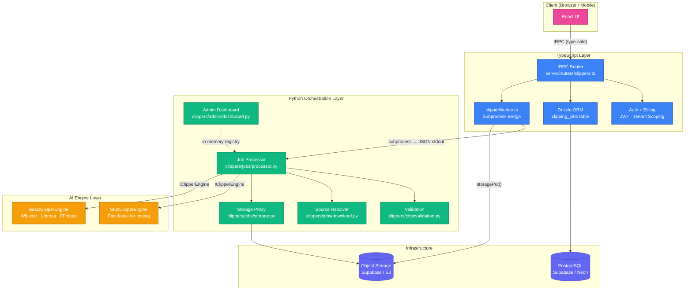
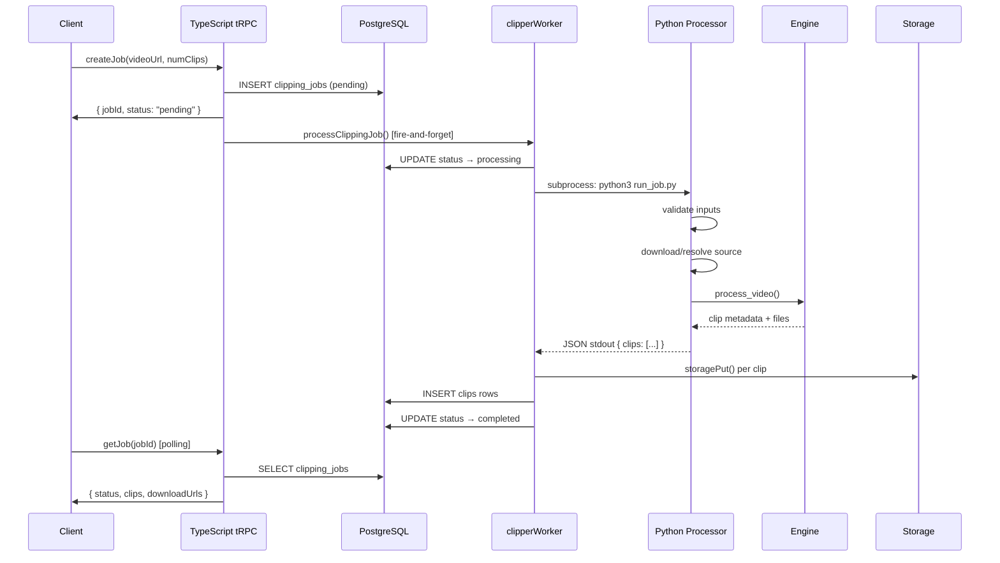

# Clippers — AI Video Clipping System

**Production-ready AI clipping infrastructure** built for UnifyOne.
Turns long-form video into short, ranked, captioned highlight clips.

---

## Architecture Overview



### Data Flow



---

## Key Components

| Directory | Purpose |
|---|---|
| `clippers/engine/` | AI processing adapters (stub + basic) |
| `clippers/jobs/` | Job orchestration, storage proxy, processor |
| `clippers/admin/` | FastAPI web dashboard |
| `clippers/config.py` | Centralized settings (Pydantic) |
| `clippers/run_job.py` | CLI entry-point for subprocess calls |

---

## Quick Start

```bash
# 1. Set up Python environment
cd clippers
python -m venv .venv
source .venv/bin/activate
pip install -r requirements.txt

# 2. Run the Admin Dashboard
python -m clippers.admin.dashboard          # http://localhost:8001

# 3. Run a test job via CLI
python -m clippers.engine.run_job \
    --engine stub \
    --num-clips 3

# 4. Run the HTTP test endpoint
python -m clippers.jobs.server --port 8787

# 5. Submit a job via curl
curl -X POST http://127.0.0.1:8787/api/clippers/test-job \
    -H 'Content-Type: application/json' \
    -d '{"num_clips": 3, "engine": "stub", "tenant_id": 1}'
```

---

## TypeScript ↔ Python Integration

The TypeScript tRPC layer owns **auth, billing, and the client API**.
The Python layer owns **execution logic and AI processing**.

```
Browser / Mobile
      │  tRPC (type-safe)
      ▼
┌──────────────────────────────────────────────────────────────────────────┐
│ TypeScript (server/routers/clippers.ts)                                   │
│ • Auth + tenant scoping (JWT, Drizzle)                                   │
│ • Job record in PostgreSQL (clipping_jobs table)                         │
│ • Calls clipperWorker.ts → subprocess to Python                          │
│ • Returns job status / signed clip URLs to client                        │
└──────────────────────────────────────────────────────────────────────────┘
      │  subprocess (python3 clippers/run_job.py) → JSON stdout
      ▼
┌──────────────────────────────────────────────────────────────────────────┐
│ Python (clippers.jobs + clippers.engine)                                  │
│ • Downloads source, validates, runs engine, uploads to storage           │
│ • Returns structured JSON: { clips: [...], status, metrics }             │
└──────────────────────────────────────────────────────────────────────────┘
      │  storage keys + signed URLs
      ▼
┌──────────────────────────────────────────────────────────────────────────┐
│ Storage (S3 / Supabase Storage)                                           │
│ Clips stored under clips/{tenantId}/{jobId}/clip_NN.mp4                  │
└──────────────────────────────────────────────────────────────────────────┘
```

### Responsibility Matrix

| Concern | Owner |
|---|---|
| Auth, billing, multi-tenancy | TypeScript (JWT + Drizzle) |
| Job record persistence | TypeScript (`clipping_jobs` table) |
| Engine execution | Python (`clippers.jobs.processor.process_job`) |
| Storage upload | TS uploads from engine output paths via `storagePut()` |
| Signed download URLs | TS generates via storage helper |
| Error surfacing | Python exits non-zero; TS writes `errorMessage` to DB |

### Key Files

| File | Purpose |
|---|---|
| `server/routers/clippers.ts` | tRPC router: createJob, getJob, listJobs, listClips, testJob |
| `server/lib/clipperWorker.ts` | Spawns `python3 clippers/run_job.py`, uploads clips, updates DB |
| `clippers/run_job.py` | CLI wrapper → `process_job` → JSON stdout |
| `clippers/jobs/processor.py` | Core end-to-end orchestrator |
| `clippers/jobs/models.py` | `ClippingJob` + `ClipResult` dataclasses (mirrors Drizzle schema) |

### Python stdout JSON Contract

`clippers/run_job.py` writes a single JSON object to stdout:

```jsonc
{
  "clips": [
    {
      "index": 1,
      "start": 10.5,
      "end": 55.0,
      "score": 0.87,
      "title_suggestion": "...",
      "caption": "...",
      "output_path": "/tmp/..."
    }
  ]
}
```

---

## Engine Selection

Precedence when choosing an engine:

1. `engine_override` argument to `process_job` (admin / debug)
2. `ClippingJob.engine` (per-job override)
3. `CLIPPERS_ENGINE` environment variable
4. Default: `basic`

| Engine | Description |
|---|---|
| `stub` | Fast fake clips, no ML deps — best for CI and smoke testing |
| `basic` | Real pipeline: faster-whisper + librosa + scenedetect + ffmpeg |

### Graceful Fallback

If `basic` fails to import (missing deps) or raises at runtime, the processor
automatically falls back to `stub` and records the fallback in
`metrics.engine_fallback` / `metrics.engine_runtime_fallback`.

---

## Configuration

### Environment Variables

| Variable | Default | Description |
|---|---|---|
| `CLIPPERS_ENGINE` | `basic` | Default engine name |
| `CLIPPERS_STORAGE_BACKEND` | `local` | `local`, `supabase`, or `s3` |
| `CLIPPERS_MAX_DURATION_SECONDS` | `10800` (3 h) | Reject sources longer than this |
| `CLIPPERS_MIN_DURATION_SECONDS` | `30` | Reject sources shorter than this |
| `CLIPPERS_MAX_FILE_SIZE_BYTES` | `5368709120` (5 GiB) | Reject sources larger than this |
| `CLIPPERS_STORAGE_ROOT` | `~/.unifyone/clippers/storage` | Local clip storage path |
| `CLIPPERS_STORAGE_BASE_URL` | `http://localhost:8787` | Base URL for signed download links |
| `CLIPPERS_STORAGE_SIGNING_SECRET` | ephemeral | HMAC secret for signed URLs |
| `CLIPPERS_SIGNED_URL_TTL_SECONDS` | `3600` | Signed URL lifetime |
| `CLIPPERS_TEMP_DIR` | `$TMPDIR/unifyone-clippers` | Temp workspace for outputs |
| `CLIPPERS_LOG_LEVEL` | `INFO` | Python log level |

See `clippers/config.py` for the full `Settings` model.

---

## Admin Dashboard

A local FastAPI dashboard for inspecting and triggering test jobs.

```bash
python -m clippers.admin.dashboard                    # http://localhost:8001
python -m clippers.admin.dashboard --port 9000 --reload
```

**Not** a production deployment target — uses the in-memory job registry.

---

## Creating a Job Programmatically

```python
from clippers.jobs import ClippingJob, process_job

job = ClippingJob(
    tenant_id=42,
    input_url="https://example.com/video.mp4",
    num_clips=5,
    target_duration=30,
    engine="basic",
)
process_job(job)

assert job.status.value == "completed"
for clip in job.clips:
    print(clip.download_url, clip.score)
```

---

## Testing

```bash
# Compile-only sanity check
python -m compileall clippers

# Run engines directly
python -m clippers.engine.test_engine --engines stub --num-clips 3

# Run engines AND the full job flow
python -m clippers.engine.test_engine --engines stub --job-flow --num-clips 3

# Use a real test video
python -m clippers.engine.test_engine --video /path/to/video.mp4 \
    --engines stub basic --job-flow
```

---

## Troubleshooting

| Symptom | Fix |
|---|---|
| `Unsupported video format` | Re-encode to mp4/mov/mkv/webm |
| Duration validation skipped | Install `ffmpeg` (provides `ffprobe`) |
| `Basic engine unavailable; falling back to stub` | `pip install -r requirements.txt` |
| Downloads fail for YouTube | `pip install yt-dlp` |
| Signed URL returns `403` | URL expired or signing secret changed |
| Signed URL returns `404` | File missing from storage — check job completed |
| Clips report `size_bytes: 0` | `ffmpeg` missing — engine wrote placeholder files |
| Concurrent jobs overwrite each other | They don't: keys embed `{tenant_id}/{job_id}` |

---

## Safety & Limits

- **Video length** — >3 h sources rejected before engine work (tunable)
- **Transient network failures** — URL downloads retry up to 3× with backoff
- **Disk cleanup** — temp files removed in `process_job`'s `finally` block
- **Thread-safety** — `ClippingJob.set_status`/`set_progress` use internal locks

---

## Deployment

See [`DEPLOYMENT.md`](./DEPLOYMENT.md) for production deployment options.

---

## Project Status (April 2026)

- ✅ Full end-to-end job execution working
- ✅ CLI + HTTP test endpoint available
- ✅ Admin dashboard included
- ✅ Clean separation between TypeScript and Python layers
- ✅ StorageProxy designed to be backend-agnostic
- ✅ Mermaid architecture diagrams
- ✅ Centralized Pydantic configuration

---

## Layer Boundary

Orchestration code (`clippers.jobs`) must not import engine internals
(`clippers.engine.basic_adapter.TranscriptionService`, etc.). It uses only
the `IClipperEngine` protocol + `get_clipper_engine` factory. This keeps
the engine swappable and the orchestration easy to unit-test.
